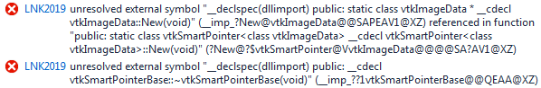
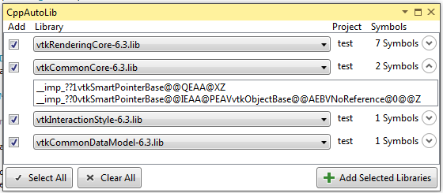
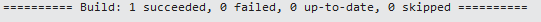

# CppAutoLib

Automatically resolve missing linker inputs in Visual Studio.

# Introduction

This tool helps you identify which libraries have to be added as linker input.

# Results

Simply click "Add Selected Libraries" to add the libraries as linker input to the current project configuration.

# Done!

CppAutoLib automatically rebuilds the project afterwards.

# Get

You can download a prebuilt VSIX package on the [releases](https://github.com/Qgel/CppAutoLib/releases) page.

# License

BSD
